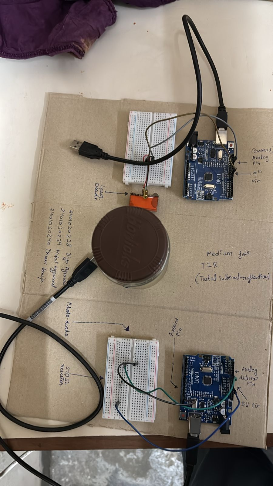

# Phijix

<!-- demo video -->
## Demo Video

<!-- Embedded demo video -->
<video src="media/vid.mp4" controls width="720">
  Your browser does not support the video tag. Download the demo: [media/vid.mp4](media/vid.mp4)
</video>

*A short demo of Phijix in action.*

---

## How the Arduino looks

Below are photos of the Arduino setup used in this project.

<!-- Images reduced in size and aligned side-by-side -->

  <figure style="margin:0; text-align:center;">
    
    <figcaption style="font-size:0.9em; margin-top:6px;">Figure 1 — Front/top view</figcaption>
  </figure>

  <figure style="margin:0; text-align:center;">
    
    <figcaption style="font-size:0.9em; margin-top:6px;">Figure 2 — Side/wiring view</figcaption>
  </figure>

  <figure style="margin:0; text-align:center;">
    
    <figcaption style="font-size:0.9em; margin-top:6px;">Figure 3 — Close-up of connections</figcaption>
  </figure>

